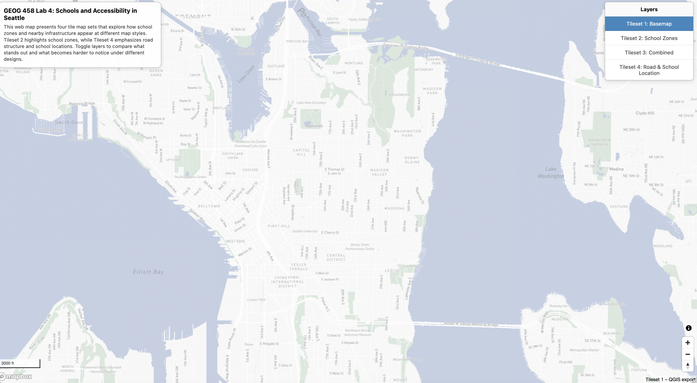
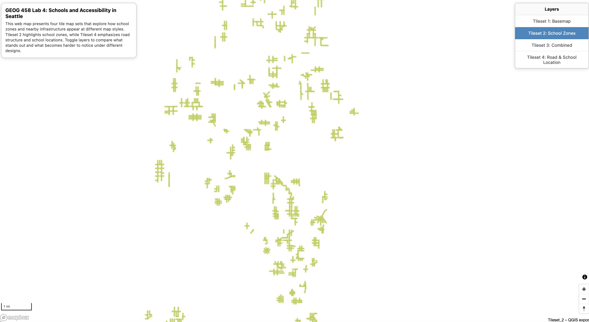
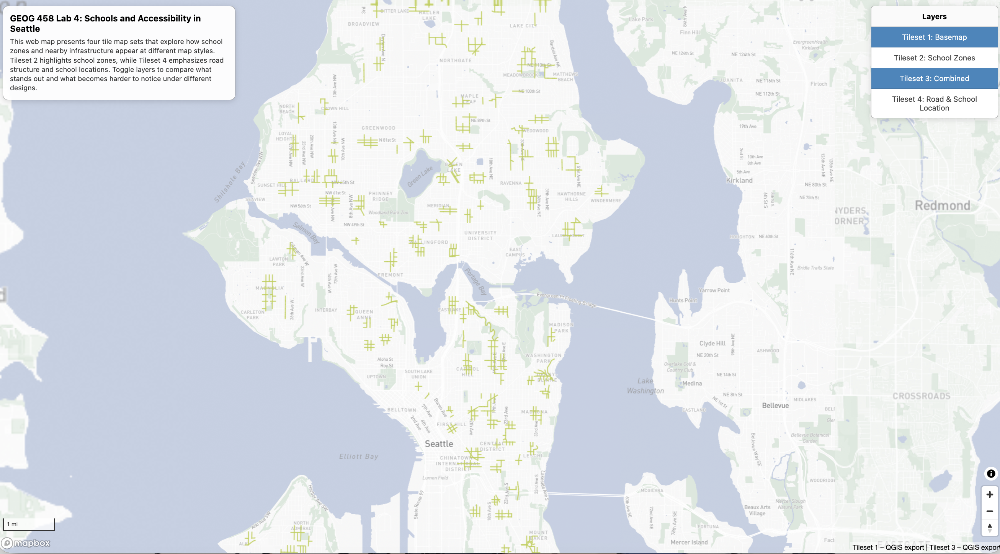
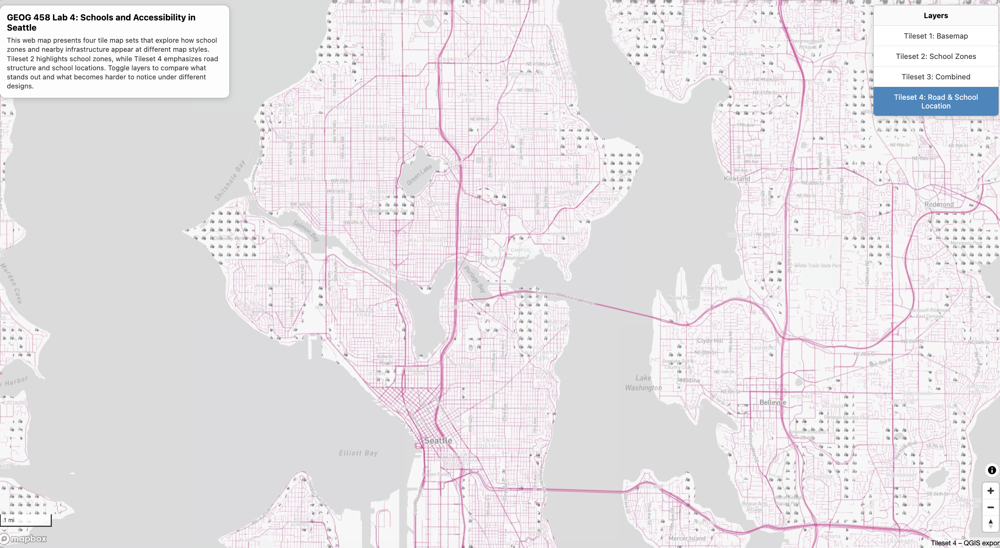

# PaisleyGEOG458lab4

## GEOG 458 Lab 4

https://paisleyw829.github.io/PaisleyGEOG458lab4/index.html

This web map was created for GEOG 458 Lab 4 and visualizes four tile map sets using Mapbox GL JS.  
Users can toggle each tileset on and off to compare how different map designs highlight geographic features related to schools and accessibility in Seattle.

## Screenshots of Tile Sets

### Tileset 1: Basemap

### Tileset 2: School Zones

### Tileset 3: Combined Map

### Tileset 4: Road & School Location Theme

## Examined Geographic Area
The examined geographic area is **Seattle, Washington**, with a focus on school zones, nearby road networks, and surrounding urban areas.  
The map allows users to explore how school-related spatial information appears under different cartographic designs.

## Available Zoom Levels
All four tile sets are available at the following zoom levels: **11–14**

Tiles will not render outside of this zoom range.

## Tile Set Descriptions

### Tileset 1: Basemap
A general basemap exported from QGIS, showing basic geographic context such as land, water, and major urban features.

### Tileset 2: School Zones
This tileset highlights school zone boundaries, emphasizing the spatial extent of school attendance areas across Seattle.

### Tileset 3: Combined Map
A combined visualization that overlays school zones on top of the basemap, allowing users to see how zoning information interacts with the surrounding urban environment.

### Tileset 4: Road & School Location Theme
A layer designed to emphasize road networks and school locations.  
This tileset focuses on accessibility and connectivity, helping users understand how transportation infrastructure relates to school placement.

## Technologies Used
- QGIS (QMetaTiles/QTiles) for tile generation
- Mapbox GL JS for web map visualization
- GitHub Pages for hosting

## AI Usage
AI tools were used for general debugging guidance and clarification of Mapbox GL JS syntax. All data processing, map design, tile generation, and final code implementation were completed independently by the author.

